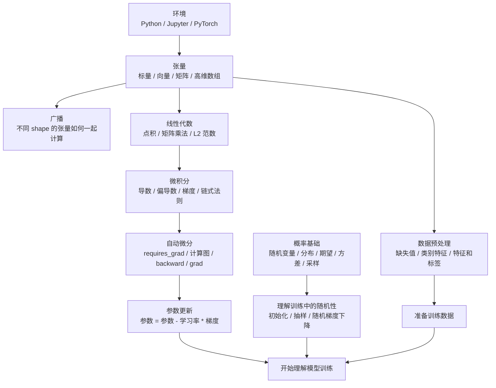

# Week 1-2 总复盘

这两周的学习主线是：先把 Python 和 PyTorch 环境跑通，再理解数据如何变成张量，最后用线性代数、微积分、自动微分和概率去解释模型训练为什么能发生。

## 知识地图

## 我现在能做什么

- 能检查 Python、Jupyter、PyTorch 环境是否可用。
- 能用 PyTorch 创建张量，并查看张量的 shape、维度数和元素个数。
- 能理解标量、向量、矩阵和更高维张量之间的区别。
- 能用广播规则完成不同 shape 张量之间的逐元素计算。
- 能用 pandas 读取简单表格数据，并处理缺失值和类别特征。
- 能把输入特征和标签分开，理解模型训练需要 `X` 和 `y`。
- 能用 PyTorch 实现点积、矩阵乘法和 L2 范数。
- 能读懂常见 shape 变化，例如 `(m, n) @ (n, p) -> (m, p)`。
- 能画出简单损失函数曲线，并理解梯度和参数更新方向的关系。
- 能用 `requires_grad=True` 让 PyTorch 跟踪计算图。
- 能调用 `backward()` 计算梯度，并从 `.grad` 中读取梯度。
- 能理解梯度需要清零，因为 PyTorch 默认会累加梯度。
- 能用 PyTorch 采样随机数，观察样本均值和样本方差接近理论值。

## 我还不理解什么

- 对高维张量的 shape 变化还不够熟，尤其是 batch、channel、sequence 这些维度的含义。
- 广播规则能跑通简单例子，但遇到更复杂的维度组合时，还需要多打印 shape 来确认。
- 数据预处理目前只会做最基础的缺失值填充和独热编码，还不熟悉标准化、归一化、训练集测试集拆分。
- 矩阵乘法的几何意义还不清楚，只知道计算规则和 shape 规则。
- 梯度下降的学习率怎么选还不理解，太大或太小会发生什么需要更多实验。
- 链式法则能看懂小例子，但复杂神经网络里的反向传播还没有完全建立直觉。
- 自动微分中的计算图、叶子张量、非叶子张量还需要继续练习。
- 概率分布只理解了正态分布和伯努利分布的基本采样，还不熟悉更多分布和它们在模型中的用途。

## 下一步学习建议

1. 用一个最小线性回归例子，把数据、矩阵乘法、损失函数、梯度、参数更新串起来。
2. 每一步都打印 shape，继续训练 shape 直觉。
3. 手写一次训练循环：前向计算、计算 loss、`backward()`、更新参数、清零梯度。
4. 对比手动梯度下降和 PyTorch 优化器 `torch.optim.SGD`。

## 一句话总结

我现在已经能用 PyTorch 表示数据、做基础张量计算、理解梯度方向，并能用自动微分拿到参数梯度。下一步要把这些单点知识连接成一个完整的模型训练流程。
